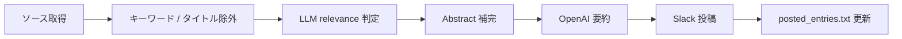

# Paper Slack Bot

[](https://www.python.org/downloads/)
[](LICENSE)

[English](README.md)

arXiv、EarthArXiv、ジャーナル RSS/API フィードを監視し、関連論文を絞り込み、Abstract を日本語要約して Slack に投稿するボットです。

研究室や研究グループが、多数のジャーナルサイトを毎日手動で確認する手間を省くために設計されています。デフォルトの要約プロンプトは固体地球物理学向けですが、設定は分野非依存です。キーワード、フィルタ、LLM の判定基準を自分の分野に合わせてカスタマイズできます。

## 特徴

- **複数ソース対応**: arXiv、EarthArXiv、RSS、Springer Nature Meta API、Copernicus 最新一覧
- **二段階フィルタ**: キーワード / タイトル除外 → LLM relevance 判定（任意）
- **Abstract 補完**: RSS に Abstract がない場合、OpenAlex / Crossref / HTML から取得
- **日本語要約**: タイトル和訳 + 4 点箇条書き（OpenAI）
- **重複防止**: 投稿済み記録の保存と自動整理
- **複数ワークスペース**: 1 つの設定で複数 Slack ワークスペースに投稿
- **ドライラン**: 投稿せずにフィルタ・要約をテスト

## 処理フロー



## クイックスタート

### 1. クローンとインストール

```bash
git clone <your-repo-url>
cd paper_slack_bots
python -m venv .venv
source .venv/bin/activate
pip install -r requirements.txt
```

### 2. 設定

```bash
cp secrets.example.yaml secrets.yaml
# secrets.yaml に API キーと Slack トークンを記入
# config.yaml を自分の研究分野に合わせて編集
```

全オプションは [docs/configuration.md](docs/configuration.md) を参照してください。

### 3. 実行

```bash
python main.py
```

### 4. 投稿せずにテスト

```bash
DRY_RUN=true DRY_RUN_CLASSIFY=true DRY_RUN_SUMMARIZE=true python main.py
```

## Slack セットアップ

1. [Slack App](https://api.slack.com/apps) を作成
2. Bot Token Scopes を追加: `chat:write`, `chat:write.public`
3. ワークスペースにインストール
4. 投稿先チャンネルにボットを招待（`/invite @YourBot`）
5. **Bot User OAuth Token**（`xoxb-...`）を `secrets.yaml` に設定
6. チャンネル ID を取得: チャンネル名を右クリック → **チャンネルの詳細を表示** → 下部の ID をコピー

## 設定ファイル

| ファイル | 用途 |
|----------|------|
| [`config.yaml`](config.yaml) | スターターテンプレート（自分の分野に合わせて編集） |
| [`secrets.example.yaml`](secrets.example.yaml) | 認証情報テンプレート（`secrets.yaml` にコピー） |
| [`examples/config.solid-earth.yaml`](examples/config.solid-earth.yaml) | 固体地球物理学の本番規模の設定例 |

### 対応ソース種別

| 種別 | `source_type` | 用途 |
|------|---------------|------|
| arXiv | （arxiv セクション） | カテゴリ + キーワード絞り込み |
| EarthArXiv | （eartharxiv セクション） | プレプリントサーバーのキーワード検索 |
| RSS | `rss`（デフォルト） | 標準的なジャーナル feed |
| Springer Nature API | `springer_api` | ISSN ベースのクエリ |
| Copernicus 最新一覧 | `copernicus_recent` | EGU / Copernicus プレプリント |

ジャーナルの追加手順は [docs/adding-sources.md](docs/adding-sources.md) を参照してください。

## GitHub Actions

[`.github/workflows/post_papers.yml`](.github/workflows/post_papers.yml) で定期実行できます。

必要な secrets: `OPENAI_API_KEY`, `SLACK_API_TOKEN`（任意で `SPRINGER_API_KEY`）。

詳細は [docs/github-actions.md](docs/github-actions.md) を参照してください。

## プロジェクト構成

```
main.py              エントリポイント
arxiv_sources.py     arXiv 取得・投稿
eartharxiv_sources.py  EarthArXiv（OAI-PMH）取得・投稿
rss_sources.py       RSS / Springer API / Copernicus 取得・投稿
classifier.py        LLM relevance 事前判定
summarizer.py        OpenAI による Abstract 要約
metadata.py          OpenAlex / Crossref による Abstract 補完
posted.py            投稿済み記録と重複排除
slack_post.py        Slack メッセージ整形・投稿
bot_config.py        設定読み込みと環境変数
```

## 自分の分野向けにカスタマイズする

1. `config.yaml` を編集 — arXiv カテゴリ、ジャーナル feed、キーワードを設定
2. `prefilter.target_scope` に、対象分野の relevant / irrelevant を平易な言葉で記述
3. 必要に応じて `summarizer.py` の要約プロンプトを分野の用語に合わせて調整
4. 本番規模の参考例: [`examples/config.solid-earth.yaml`](examples/config.solid-earth.yaml)

## 既知の制限

- 一部出版社（Elsevier、Wiley 等）の RSS では Abstract が欠落または短縮される
- Springer API と GitHub Models には別途 API キー / トークンが必要
- 要約のデフォルトは固体地球物理学向けの用語。他分野では `summarizer.py` の調整を推奨
- Slack（投稿間 2 秒）、arXiv（5 秒遅延）、各 API プロバイダにレート制限あり

## セキュリティ

* `secrets.yaml` は `.gitignore` に含まれています。認証情報は絶対にコミットしないでください。
* CI/CD で利用する認証情報は、GitHub Actions secrets に登録してください。
* Slack bot token が外部に漏えいした可能性がある場合は、直ちに token を再発行してください。

## Credits / 謝辞

このプロジェクトは、[Butadiene](https://github.com/Butadiene/paper_slack_bots) さんが作成した Slack bot をもとにしています。

現在のバージョンは、より広い範囲の学術誌に対応するため、Kh-Yabu が改変・保守しています。

## License / ライセンス

このプロジェクトは MIT License の下で公開されています。

Original work:

* Copyright (c) 2025 Butadiene

Modifications:

* Copyright (c) 2026 Kh-Yabu

詳細は [LICENSE](./LICENSE) を参照してください。
