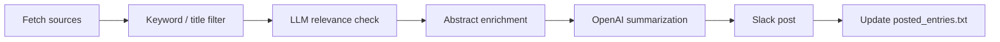

# Paper Slack Bot

[](https://www.python.org/downloads/)
[](LICENSE)

[日本語](README.ja.md)

A Slack bot that monitors arXiv, EarthArXiv, and journal RSS/API feeds, filters papers by relevance, summarizes abstracts in Japanese, and posts them to Slack.

Designed for research groups that want a curated paper feed without manually checking dozens of journal sites every day. The default summarization prompt targets solid Earth geophysics, but the configuration is field-agnostic — customize keywords, filters, and LLM scope for any discipline.

## Features

- **Multiple sources**: arXiv, EarthArXiv, RSS feeds, Springer Nature Meta API, Copernicus recent listings
- **Two-stage filtering**: keyword / title exclusion, then optional LLM relevance prefilter
- **Abstract enrichment**: fallback to OpenAlex, Crossref, or HTML when RSS lacks abstracts
- **Japanese summarization**: title translation + 4-point bullet summary via OpenAI
- **Duplicate prevention**: posted-entry tracking with automatic pruning
- **Multi-workspace**: post to different Slack workspaces from one config
- **Dry-run mode**: test filters and summarization without posting

## How it works



## Quick start

### 1. Clone and install

```bash
git clone <your-repo-url>
cd paper_slack_bots
python -m venv .venv
source .venv/bin/activate
pip install -r requirements.txt
```

### 2. Configure

```bash
cp secrets.example.yaml secrets.yaml
# Edit secrets.yaml with your API keys and Slack tokens
# Edit config.yaml for your research field and journal feeds
```

See [docs/configuration.md](docs/configuration.md) for all options.

### 3. Run

```bash
python main.py
```

### 4. Test without posting

```bash
DRY_RUN=true DRY_RUN_CLASSIFY=true DRY_RUN_SUMMARIZE=true python main.py
```

## Slack setup

1. Create a [Slack App](https://api.slack.com/apps) in your workspace
2. Add Bot Token Scopes: `chat:write`, `chat:write.public`
3. Install the app to your workspace
4. Invite the bot to the target channel (`/invite @YourBot`)
5. Copy the **Bot User OAuth Token** (`xoxb-...`) to `secrets.yaml`
6. Get the channel ID: right-click the channel → **View channel details** → copy ID at the bottom

## Configuration

| File | Purpose |
|------|---------|
| [`config.yaml`](config.yaml) | Starter template — customize for your field |
| [`secrets.example.yaml`](secrets.example.yaml) | Credentials template (copy to `secrets.yaml`) |
| [`examples/config.solid-earth.yaml`](examples/config.solid-earth.yaml) | Full example for solid Earth geophysics |

### Supported source types

| Type | `source_type` | Use case |
|------|---------------|----------|
| arXiv | (arxiv section) | Category + keyword filtering |
| EarthArXiv | (eartharxiv section) | Preprint server keyword search |
| RSS | `rss` (default) | Standard journal feeds |
| Springer Nature API | `springer_api` | ISSN-based queries, Nature portfolio |
| Copernicus recent | `copernicus_recent` | EGU / Copernicus preprint listings |

See [docs/adding-sources.md](docs/adding-sources.md) for step-by-step guides.

## GitHub Actions

Run the bot on a schedule with [`.github/workflows/post_papers.yml`](.github/workflows/post_papers.yml).

Required secrets: `OPENAI_API_KEY`, `SLACK_API_TOKEN` (and optionally `SPRINGER_API_KEY`).

See [docs/github-actions.md](docs/github-actions.md) for setup details.

## Project structure

```
main.py              Entry point — iterates workspaces and sources
arxiv_sources.py     arXiv fetch and post
eartharxiv_sources.py  EarthArXiv (OAI-PMH) fetch and post
rss_sources.py       RSS / Springer API / Copernicus fetch and post
classifier.py        LLM relevance prefilter
summarizer.py        OpenAI abstract summarization
metadata.py          OpenAlex / Crossref abstract enrichment
posted.py            Posted-entry tracking and deduplication
slack_post.py        Slack message formatting and posting
bot_config.py        Config loading and environment variables
```

## Customizing for your field

1. Edit `config.yaml` — set arXiv categories, journal feeds, and keywords for your domain
2. Write `prefilter.target_scope` in plain language describing what is relevant
3. Optionally adjust the summarization prompt in `summarizer.py` for your field's terminology
4. See [`examples/config.solid-earth.yaml`](examples/config.solid-earth.yaml) for a production-scale reference

## Known limitations

- RSS feeds from some publishers (Elsevier, Wiley) may omit or truncate abstracts
- Springer API and GitHub Models require separate API keys / tokens
- Summarization defaults to solid Earth geophysics terminology; customize `summarizer.py` for other fields
- Rate limits apply to Slack (2 s between posts), arXiv (5 s delay), and API providers

## Security

* `secrets.yaml` is listed in `.gitignore` — never commit credentials.
* Use GitHub Actions secrets for CI deployment.
* Rotate Slack bot tokens immediately if they are exposed.

## Credits

This project is based on an original Slack bot created by [Butadiene](https://github.com/Butadiene/paper_slack_bots).

The current version has been modified and maintained by Kh-Yabu to support a broader range of journals.

## License

This project is licensed under the MIT License.

Original work:

* Copyright (c) 2025 Butadiene

Modifications:

* Copyright (c) 2026 Kh-Yabu

See [LICENSE](./LICENSE) for details.
